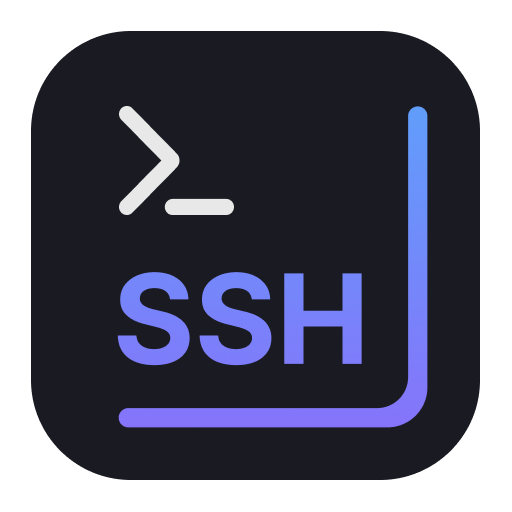
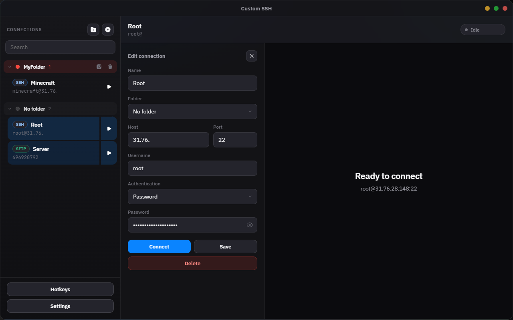
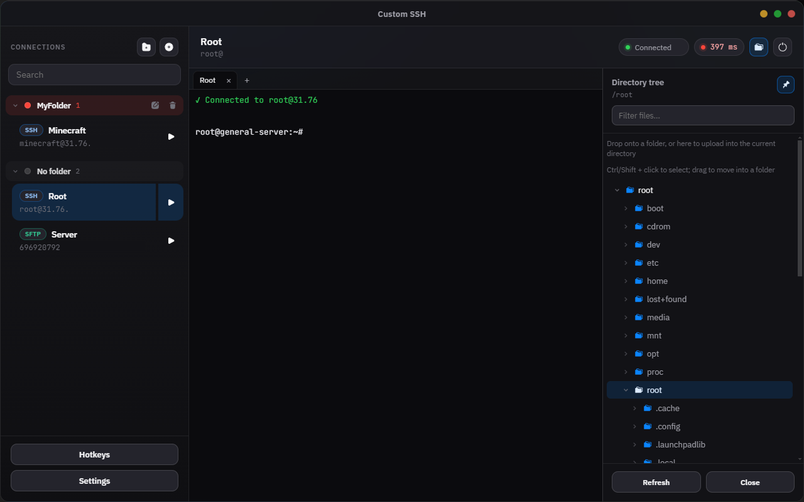
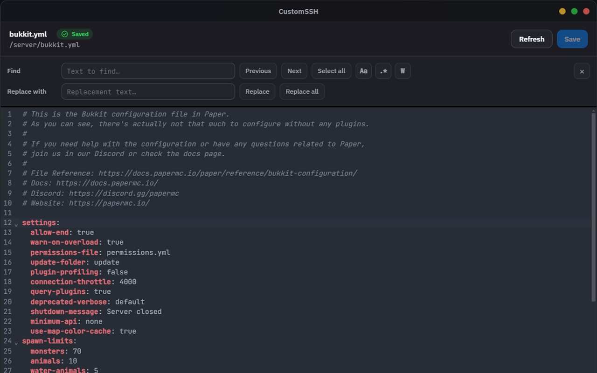
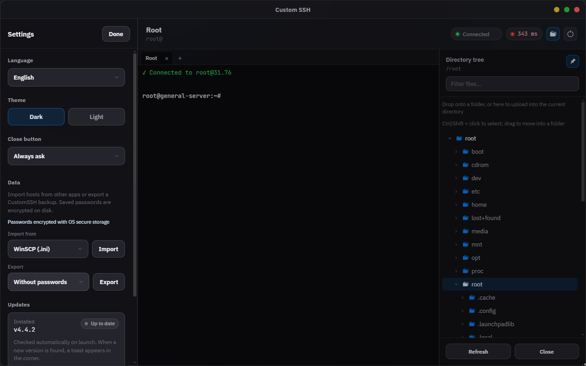
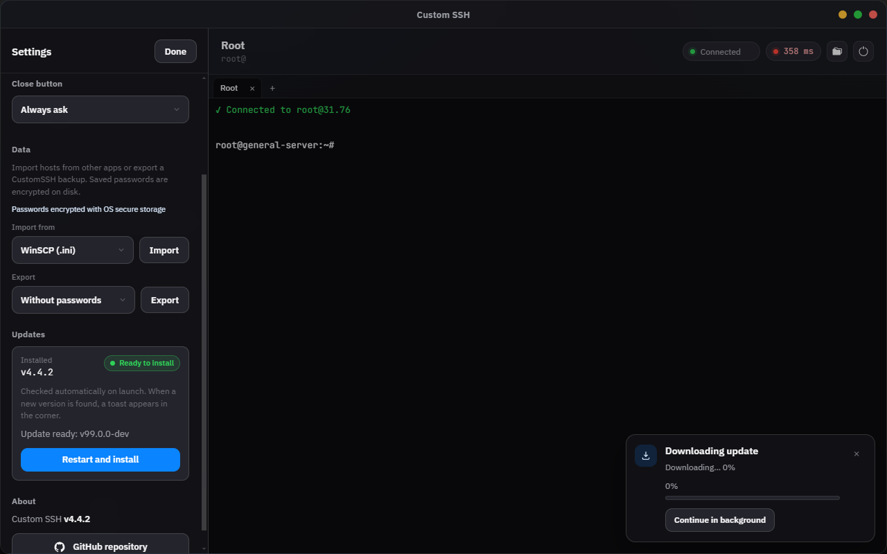

<p align="center">
  
</p>

<h1 align="center">CustomSSH</h1>

<p align="center">
  <strong>Десктопный SSH-клиент</strong> для Windows, macOS и Linux<br />
  Подключения · терминал · файлы на сервере · редактор
</p>

<p align="center">
  <a href="#-русский">Русский</a> · <a href="#-english">English</a>
</p>

<p align="center">
  <a href="https://github.com/GoblinThug/Custom-SSH/releases/latest"></a>
  <a href="https://github.com/GoblinThug/Custom-SSH/releases"></a>
  <a href="https://github.com/GoblinThug/Custom-SSH"></a>
  <a href="https://github.com/GoblinThug/Custom-SSH"></a>
</p>

<p align="center">
  <a href="https://github.com/GoblinThug/Custom-SSH/releases/latest"><strong>⬇️ Скачать последнюю версию</strong></a>
  &nbsp;·&nbsp;
  <a href="https://github.com/GoblinThug/Custom-SSH/issues">🐞 Сообщить о проблеме</a>
</p>

---

# 🇷🇺 Русский

## ✨ Что это

**CustomSSH** — локальный SSH-клиент для работы с удалёнными серверами: сохранённые хосты, полноценный терминал, дерево файлов по SFTP и редактор с подсветкой синтаксиса.

| | Возможность |
|---|---|
| 🗂️ | Сохранённые подключения и цветные папки |
| ⌨️ | Терминал с вкладками, поиском по выводу и настраиваемыми хоткеями |
| 📁 | Дерево файлов: просмотр, upload/download, CRUD, фильтр, закрепление |
| 🚚 | Панель передач: прогресс, отмена файлов, возобновление после обрыва |
| 📝 | Редактор в отдельном окне с сохранением на сервер |
| 🔄 | Автопереподключение и индикатор пинга |
| 🔐 | Шифрование паролей на диске |
| 📦 | Импорт из WinSCP / FileZilla / Termius и экспорт бэкапа |
| 🎨 | Тёмная / светлая тема, русский и английский |
| ⬆️ | Обновления: авто на Windows (Setup) и Linux (AppImage); на macOS — ссылка на Releases |

Текущая версия в репозитории: **`4.1.3`** (актуальный номер всегда в [Releases](https://github.com/GoblinThug/Custom-SSH/releases)).

---

## 📸 Скриншоты


<p align="center">
  
</p>

<p align="center">
  
  &nbsp;
  
</p>

<p align="center">
  
  &nbsp;
  
</p>

## ⬇️ Скачать и установить

Готовые сборки: **[GitHub Releases →](https://github.com/GoblinThug/Custom-SSH/releases)**

### 🪟 Windows

| Файл | Когда брать |
|---|---|
| `CustomSSH-Setup-….exe` | Обычная установка — **рекомендуется**, есть автообновление |
| `CustomSSH-Portable-….exe` | Без установки; обновлять вручную с Releases |

1. Скачайте Setup или Portable.
2. Запустите файл.
3. Для Setup пройдите мастер и откройте CustomSSH из меню «Пуск» или с рабочего стола.

> ⚠️ Windows может показать **SmartScreen**. Если доверяете сборке с GitHub: **Подробнее** → **Выполнить в любом случае**.

### 🍎 macOS

| Файл | Когда брать |
|---|---|
| `CustomSSH-…-arm64.dmg` | Apple Silicon (M1 / M2 / M3 / …) |
| `CustomSSH-…-x64.dmg` | Intel Mac |
| `CustomSSH-…-arm64.zip` / `x64.zip` | Архив приложения (ручная замена) |

1. Скачайте `.dmg` под свой чип.
2. Откройте образ и перетащите приложение в **Программы**.
3. Запустите CustomSSH.

> ⚠️ Сборка **не подписана** Apple Developer ID. Сообщение «приложение повреждено» — это Gatekeeper, не битый файл.  
> **ПКМ** по приложению → **Открыть** → снова **Открыть**,  
> либо в Terminal:
>
> ```bash
> xattr -cr /Applications/CustomSSH.app
> ```

### 🐧 Linux

| Файл | Когда брать |
|---|---|
| `CustomSSH-…-x64.AppImage` | Универсальный запуск без установки — **рекомендуется**, есть автообновление |
| `CustomSSH-…-x64.deb` | Установка в Debian / Ubuntu и производных |

**AppImage**

```bash
chmod +x CustomSSH-*-x64.AppImage
./CustomSSH-*-x64.AppImage
```

**deb**

```bash
sudo apt install ./CustomSSH-*-x64.deb
# или
sudo dpkg -i CustomSSH-*-x64.deb
```

> Для AppImage на некоторых дистрибутивах нужен FUSE (`libfuse2` / `fuse`).  
> Архитектура сборки: **x64** (amd64).

---

## 🚀 Быстрый старт

1. Откройте CustomSSH.
2. Создайте подключение или выберите сохранённое в сайдбаре (клик по серверу открывает форму).
3. Укажите хост, порт, пользователя; вход — **пароль** или **приватный ключ**.
4. Нажмите **Подключиться**.
5. Работайте в терминале; дерево файлов — справа (можно закрепить булавкой).

Подключения можно группировать по папкам и искать в сайдбаре.

---

## 📚 Основные возможности

### ⌨️ Терминал

- Полноценный SSH-терминал
- Несколько вкладок: новый shell (`+`), переименование (двойной клик), перетаскивание
- Переподключение активной вкладки не сбрасывает остальные
- Поиск по выводу: **Ctrl+F** / **⌘+F** (Enter — далее, Shift+Enter — назад, Esc — закрыть)
- Пинг и статус в верхней панели
- Автопереподключение при обрыве
- Копирование выделения, вставка (ПКМ / хоткеи)
- Горячие клавиши настраиваются в разделе **Горячие клавиши** (Ctrl ↔ ⌘): копирование, вставка, выделение строки, Interrupt / Suspend

### 📁 Файлы на сервере

Панель дерева (иконка папки при активной сессии):

- Обзор каталогов, drag-and-drop и загрузка файлов
- Скачивание файлов и папок
- Создать / переименовать / удалить (контекстное меню)
- Выделение: **Ctrl/⌘+клик** и **Shift+клик**
- Двойной клик по файлу — редактор
- Фильтр по имени в шапке панели
- **Закрепить** панель справа (булавка) — без затемнения, остаётся открытой
- Путь в шапке: двойной клик — правка, **Enter** / кнопка **Перейти** — переход в дереве (**cwd терминала не меняется**)

### 🚚 Передачи файлов

Нижняя панель **Загрузки** показывает активные upload/download:

- Прогресс по пакету и список файлов
- Отмена отдельных файлов
- При обрыве связи передача **возобновляется** после переподключения (временные `.customssh.part`)
- Очистка завершённых записей одной кнопкой

### 📝 Редактор

- Отдельное окно с подсветкой синтаксиса
- Сохранение обратно на сервер
- Предупреждение о несохранённых изменениях
- Отступ Tab — 4 пробела

### 🗂️ Подключения и данные

- Папки с цветами, поиск в сайдбаре
- Пароли и passphrase на диске **шифруются** (Windows DPAPI / macOS Keychain через Electron `safeStorage`)
- **Настройки → Данные:**
  - импорт из **WinSCP** (`.ini`), **FileZilla** (`.xml`), **Termius** (`.json`), а также бэкап CustomSSH
  - экспорт копии без паролей или **с паролями** (AES + парольная фраза)

### ⚙️ Настройки

- Язык: русский / English
- Тема: тёмная / светлая
- Импорт и экспорт данных
- Проверка обновлений
- Ссылка на GitHub

---

## ⬆️ Обновления

### Windows

Установленная версия (**не** Portable) проверяет обновления при запуске и из **Настроек**.

1. Появится диалог: обновить или позже.
2. После скачивания — перезапуск для установки.

Portable обновляется только вручную с [Releases](https://github.com/GoblinThug/Custom-SSH/releases).

### macOS

Автоустановка через ShipIt **недоступна** (сборка без подписи Apple).  
При новой версии приложение предложит открыть **GitHub Releases** — скачайте новый `.dmg` и замените приложение в **Программах**.

### Linux

**AppImage** проверяет обновления при запуске и из **Настроек** (нужен `latest-linux.yml` в релизе).  
**.deb** — обновляйте вручную с [Releases](https://github.com/GoblinThug/Custom-SSH/releases) или через менеджер пакетов после новой установки.

Ошибки обновления показываются короткими понятными сообщениями (сеть, файл не найден, подпись и т.д.), а не сырым текстом updater’а.

---

## 🔐 Безопасность

- Данные подключений хранятся **только локально** на вашем компьютере.
- Пароли в `connections.json` — в зашифрованном виде.
- Не передавайте Portable с уже сохранёнными паролями.
- Приватные ключи удобнее хранить у себя и указывать путь в подключении.
- Экспорт **с паролями** защищён отдельной фразой — без неё бэкап на другом ПК не откроется.

---

## 🛟 Проблемы?

| Ситуация | Что сделать |
|---|---|
| Не подключается | Проверьте хост, порт, логин, пароль/ключ и доступность сервера |
| Ключ не принимается | Тип входа «приватный ключ» и верный файл |
| На Mac «повреждено» | ПКМ → Открыть или `xattr -cr /Applications/CustomSSH.app` |
| Нет обновлений (Win) | Нужен Setup (не Portable) и `latest.yml` в релизе |
| Обновление на Mac | Скачайте новый `.dmg` с Releases вручную |
| Нет обновлений (Linux) | Используйте AppImage (не только `.deb`) и `latest-linux.yml` в релизе |
| AppImage не запускается | `chmod +x …` и установите FUSE (`libfuse2`) |
| Импорт без паролей | В исходном экспорте паролей не было / master password WinSCP |
| Вопросы и баги | [Issues](https://github.com/GoblinThug/Custom-SSH/issues) |

---

## 🛠️ Для разработчиков

Подробнее: [CONTRIBUTING.md](CONTRIBUTING.md) · [SECURITY.md](SECURITY.md) · [LICENSE](LICENSE) / [LICENSE.ru](LICENSE.ru)

```bash
git clone https://github.com/GoblinThug/Custom-SSH.git
cd Custom-SSH
npm install
npm run dev
npm test
npm run lint
npm run typecheck
```

Локальная сборка:

```bash
npm run dist          # Windows → release/
npm run dist:mac      # macOS (нужен Mac)
npm run dist:linux    # Linux → AppImage + deb (удобнее на Linux)
```

### Релиз через GitHub Actions

Workflow [`.github/workflows/release.yml`](.github/workflows/release.yml) собирает **Windows, macOS и Linux** и публикует GitHub Release.

1. Поднимите `version` в `package.json`.
2. Закоммитьте и запушьте в `main`.
3. Actions → **Release** создаст тег `vX.Y.Z` (если нужно), соберёт все платформы в **черновик** релиза, затем опубликует его (`latest.yml`, `latest-mac.yml`, `latest-linux.yml`, Setup/Portable, DMG/ZIP, AppImage/deb).

Пуш тега `v*` или ручной **Run workflow** тоже запускают публикацию.

> Черновик нужен потому, что опубликованный GitHub Release может быть immutable — в него нельзя догрузить файлы с других OS.
>
> Каждый пуш в `main` публикует релиз для **текущей** версии из `package.json`.  
> Чтобы вышла новая версия — сначала измените `version`, потом пуш.  
> Если релиз этой версии уже опубликован и CI падает с «immutable» — удалите его на GitHub (тег можно оставить) и перезапустите workflow.

---

# 🇬🇧 English

## ✨ What it is

**CustomSSH** is a local desktop SSH client for remote servers: saved hosts, a full terminal, an SFTP file tree, and a syntax-highlighted editor. Available on **Windows**, **macOS**, and **Linux**.

| | Feature |
|---|---|
| 🗂️ | Saved connections and colored folders |
| ⌨️ | Multi-tab terminal, find-in-output, configurable hotkeys |
| 📁 | Remote file tree: browse, upload/download, CRUD, filter, pin |
| 🚚 | Transfer dock: progress, per-file cancel, resume after reconnect |
| 📝 | Editor in a separate window with save-to-server |
| 🔄 | Auto-reconnect and latency indicator |
| 🔐 | Encrypted passwords on disk |
| 📦 | Import from WinSCP / FileZilla / Termius and backup export |
| 🎨 | Dark / light theme, English & Russian |
| ⬆️ | Updates: auto on Windows Setup and Linux AppImage; on macOS — open Releases |

Repo version: **`4.1.3`** (always check [Releases](https://github.com/GoblinThug/Custom-SSH/releases) for the latest).

---

## 📸 Screenshots


<p align="center">
  
</p>

<p align="center">
  
  &nbsp;
  
</p>

<p align="center">
  
  &nbsp;
  
</p>

## ⬇️ Download & install

Prebuilt packages: **[GitHub Releases →](https://github.com/GoblinThug/Custom-SSH/releases)**

### 🪟 Windows

| File | Use when |
|---|---|
| `CustomSSH-Setup-….exe` | Normal install — **recommended**, includes auto-update |
| `CustomSSH-Portable-….exe` | No install; update manually from Releases |

1. Download Setup or Portable.
2. Run the file.
3. Finish the wizard and launch from the Start menu or desktop.

> ⚠️ SmartScreen may warn about an unknown publisher. If you trust the GitHub release: **More info** → **Run anyway**.

### 🍎 macOS

| File | Use when |
|---|---|
| `CustomSSH-…-arm64.dmg` | Apple Silicon |
| `CustomSSH-…-x64.dmg` | Intel Mac |
| `CustomSSH-…-arm64.zip` / `x64.zip` | App archive (manual replace) |

1. Download the `.dmg` for your chip.
2. Open it and drag the app into **Applications**.
3. Launch CustomSSH.

> ⚠️ Builds are **not** Apple Developer ID signed. “App is damaged” is Gatekeeper.  
> **Right-click** → **Open** → **Open**, or:
>
> ```bash
> xattr -cr /Applications/CustomSSH.app
> ```

### 🐧 Linux

| File | Use when |
|---|---|
| `CustomSSH-…-x64.AppImage` | Run without installing — **recommended**, includes auto-update |
| `CustomSSH-…-x64.deb` | Install on Debian / Ubuntu and derivatives |

**AppImage**

```bash
chmod +x CustomSSH-*-x64.AppImage
./CustomSSH-*-x64.AppImage
```

**deb**

```bash
sudo apt install ./CustomSSH-*-x64.deb
# or
sudo dpkg -i CustomSSH-*-x64.deb
```

> Some distros need FUSE for AppImage (`libfuse2` / `fuse`).  
> Build architecture: **x64** (amd64).

---

## 🚀 Quick start

1. Open CustomSSH.
2. Create a connection or pick one in the sidebar (click a server to edit).
3. Set host, port, user; auth — **password** or **private key**.
4. Click **Connect**.
5. Use the terminal; open the file tree on the right (can be pinned).

Group connections into folders and search in the sidebar.

---

## 📚 Main features

### ⌨️ Terminal

- Full SSH terminal
- Multiple tabs: new shell (`+`), rename (double-click), drag-reorder
- Reconnecting the active tab keeps the others
- Find in output: **Ctrl+F** / **⌘+F** (Enter / Shift+Enter, Esc to close)
- Latency and status in the toolbar
- Auto-reconnect on drop
- Copy-on-select, paste (right-click / hotkeys)
- Shortcuts under **Hotkeys** (Ctrl ↔ ⌘): copy, paste, select line, Interrupt / Suspend

### 📁 Remote files

Directory tree panel (folder icon while connected):

- Browse folders, drag-and-drop upload
- Download files and folders
- Create / rename / delete via context menu
- Selection: **Ctrl/⌘+click** and **Shift+click**
- Double-click a file to edit
- Name filter in the panel header
- **Pin** the panel on the right
- Path bar: double-click to edit, **Enter** / **Go** to navigate the tree (**terminal cwd stays unchanged**)

### 🚚 Transfers

Bottom **Transfers** dock for active uploads/downloads:

- Batch progress and per-file list
- Cancel individual files
- On disconnect, transfers **resume** after reconnect (temporary `.customssh.part` files)
- Clear finished items in one click

### 📝 Editor

- Separate window with syntax highlighting
- Save back to the server
- Unsaved-changes prompt
- Tab width fixed at 4 spaces

### 🗂️ Connections & data

- Colored folders, sidebar search
- Passwords/passphrases **encrypted at rest** (DPAPI / Keychain via Electron `safeStorage`)
- **Settings → Data:**
  - import from **WinSCP** (`.ini`), **FileZilla** (`.xml`), **Termius** (`.json`), or a CustomSSH backup
  - export without passwords, or **with passwords** (AES + passphrase)

### ⚙️ Settings

- Language: English / Russian
- Theme: dark / light
- Data import / export
- Update check
- GitHub link

---

## ⬆️ Updates

### Windows

Installed builds (**not** Portable) check on launch and from **Settings**.  
Portable: update manually from Releases.

### macOS

In-app ShipIt install is **unavailable** (unsigned builds).  
When an update is found, CustomSSH opens **GitHub Releases** — download a new `.dmg` and replace the app in **Applications**.

### Linux

**AppImage** checks for updates on launch and from **Settings** (needs `latest-linux.yml` in the release).  
**.deb** — update manually from [Releases](https://github.com/GoblinThug/Custom-SSH/releases) or reinstall the new package.

Update errors are shown as short localized messages instead of raw updater text.

---

## 🔐 Security

- Connection data stays **local**.
- Passwords in `connections.json` are encrypted.
- Don’t share a portable build that already has saved passwords.
- Prefer key files on disk with a path in the connection.
- Password-inclusive exports need the backup passphrase to restore elsewhere.

---

## 🛟 Troubleshooting

| Issue | What to try |
|---|---|
| Can’t connect | Host, port, user, password/key, reachability |
| Key rejected | Private-key auth and correct file |
| macOS “damaged” | Right-click → Open, or `xattr -cr /Applications/CustomSSH.app` |
| No updates (Win) | Use Setup (not Portable) and ensure `latest.yml` is in the release |
| macOS updates | Download a new `.dmg` from Releases |
| No updates (Linux) | Use AppImage (not only `.deb`) and ensure `latest-linux.yml` is in the release |
| AppImage won’t start | `chmod +x …` and install FUSE (`libfuse2`) |
| Import without passwords | Source export had none / WinSCP master password |
| Bugs | [Issues](https://github.com/GoblinThug/Custom-SSH/issues) |

---

## 🛠️ For developers

See also: [CONTRIBUTING.md](CONTRIBUTING.md) · [SECURITY.md](SECURITY.md) · [LICENSE](LICENSE) / [LICENSE.ru](LICENSE.ru)

```bash
git clone https://github.com/GoblinThug/Custom-SSH.git
cd Custom-SSH
npm install
npm run dev
npm test
npm run lint
npm run typecheck
```

Local build:

```bash
npm run dist          # Windows → release/
npm run dist:mac      # macOS (needs a Mac)
npm run dist:linux    # Linux → AppImage + deb (best on Linux)
```

### Release via GitHub Actions

[`.github/workflows/release.yml`](.github/workflows/release.yml) builds **Windows + macOS + Linux** and publishes a GitHub Release.

1. Bump `version` in `package.json`.
2. Commit and push to `main`.
3. Actions → **Release** creates tag `vX.Y.Z` if needed, uploads all platform assets into a **draft** release, then publishes it (`latest.yml`, `latest-mac.yml`, `latest-linux.yml`, Setup/Portable, DMG/ZIP, AppImage/deb).

Pushing a `v*` tag or running the workflow manually also publishes.

> Drafts are required because a published GitHub Release can be immutable — other OS jobs cannot upload more assets afterward.
>
> Every push to `main` publishes for the **current** `package.json` version — bump `version` before pushing when you want a new release number.
> If this version’s release is already published and CI fails with “immutable”, delete that release on GitHub (tag can stay) and re-run the workflow.

---

<p align="center">
  <br />
  <strong>CustomSSH</strong> · by Goblin_Thug<br />
  <a href="https://github.com/GoblinThug/Custom-SSH/releases">Downloads</a>
  ·
  <a href="https://github.com/GoblinThug/Custom-SSH">GitHub</a>
  ·
  <a href="https://github.com/GoblinThug/Custom-SSH/issues">Issues</a>
  ·
  <a href="CONTRIBUTING.md">Contributing</a>
  ·
  <a href="SECURITY.md">Security</a>
  ·
  <a href="LICENSE">MIT</a>
</p>
